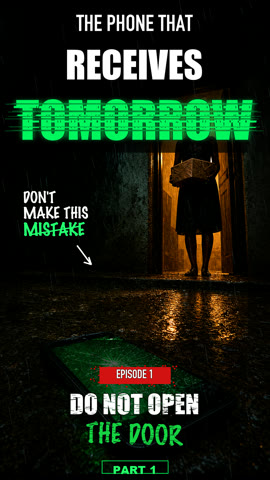
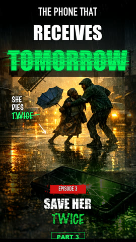
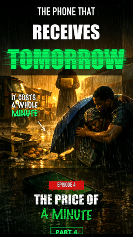
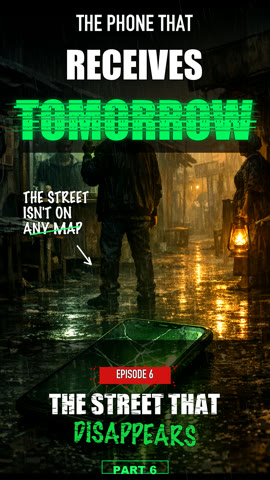
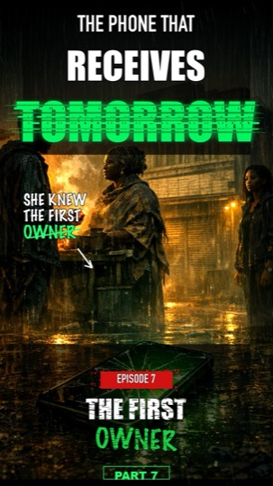
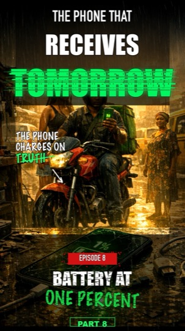
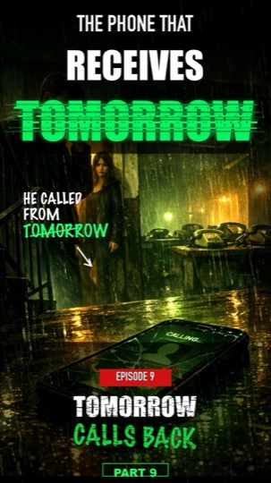
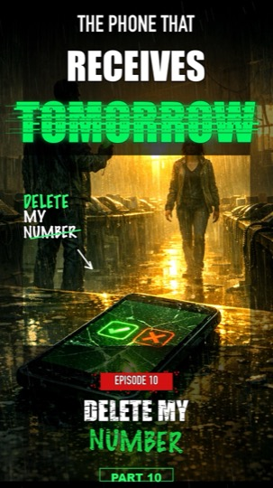

# Storyforge

**Turn written short-fiction episodes into vertical videos for TikTok, Instagram Reels, and YouTube Shorts — from your laptop.**

Storyforge is a local production pipeline. You write an episode (a short script + a few scene prompts), and it produces a finished, ready-to-post vertical video:

- 🎙️ ElevenLabs narrator voiceover
- 🖼️ OpenAI scene images
- 🎬 A branded cover/poster intro (AI background + local typography)
- 🎞️ Motion clips from stills — **no video-API credits required** (optional fal.ai motion if you want it)
- 📱 Final synced **1080×1920** vertical MP4, plus a preview grid and image contact sheet

> No timeline editor, no manual rendering. Author text → run one command → get an MP4.

---

## ▶️ Watch example episodes

The sample series **"The Phone That Receives Tomorrow"** (an Afro-futurist mystery thriller) was produced entirely with this pipeline.

**▶ [Watch all 10 episodes in the browser (embedded player)](docs/preview/index.html)** — playable YouTube embeds, no leaving the page.

On GitHub.com, README cover art links out to YouTube (GitHub strips iframe embeds). Click any poster below, or open the [episode viewer](docs/preview/index.html).

<!-- README-PLAYER-START -->

<table>
  <tr>
    <td align="center" width="33%">
      <a href="https://youtube.com/shorts/Bh6mAgm_QtI"></a><br>
      <b><a href="https://youtube.com/shorts/Bh6mAgm_QtI">Ep 1 · Do Not Open The Door</a></b>
    </td>
    <td align="center" width="33%">
      <a href="https://youtube.com/shorts/Y2-6ruKLOF8"></a><br>
      <b><a href="https://youtube.com/shorts/Y2-6ruKLOF8">Ep 2 · The Bus With No Driver</a></b>
    </td>
    <td align="center" width="33%">
      <a href="https://youtube.com/shorts/P7XBdPvjcJ8"></a><br>
      <b><a href="https://youtube.com/shorts/P7XBdPvjcJ8">Ep 3 · Save Her Twice</a></b>
    </td>
  </tr>
  <tr>
    <td align="center" width="33%">
      <a href="https://youtube.com/shorts/DLaWm1o32fY"></a><br>
      <b><a href="https://youtube.com/shorts/DLaWm1o32fY">Ep 4 · The Price Of A Minute</a></b>
    </td>
    <td align="center" width="33%">
      <a href="https://youtube.com/shorts/-NcfeG9QFpE"></a><br>
      <b><a href="https://youtube.com/shorts/-NcfeG9QFpE">Ep 5 · Mara's Name</a></b>
    </td>
    <td align="center" width="33%">
      <a href="https://youtube.com/shorts/AcZlC_kdeNs"></a><br>
      <b><a href="https://youtube.com/shorts/AcZlC_kdeNs">Ep 6 · The Street That Disappears</a></b>
    </td>
  </tr>
  <tr>
    <td align="center" width="33%">
      <a href="https://youtube.com/shorts/L8ZU78CpKuc"></a><br>
      <b><a href="https://youtube.com/shorts/L8ZU78CpKuc">Ep 7 · The First Owner</a></b>
    </td>
    <td align="center" width="33%">
      <a href="https://youtube.com/shorts/YWWyK7UIfWQ"></a><br>
      <b><a href="https://youtube.com/shorts/YWWyK7UIfWQ">Ep 8 · Battery At One Percent</a></b>
    </td>
    <td align="center" width="33%">
      <a href="https://youtube.com/shorts/qTONDPdGxa8"></a><br>
      <b><a href="https://youtube.com/shorts/qTONDPdGxa8">Ep 9 · Tomorrow Calls Back</a></b>
    </td>
  </tr>
  <tr>
    <td align="center" width="33%">
      <a href="https://youtube.com/shorts/shIX0gKaJDs"></a><br>
      <b><a href="https://youtube.com/shorts/shIX0gKaJDs">Ep 10 · Delete My Number</a></b>
    </td>
    <td colspan="2"></td>
  </tr>
</table>
<!-- README-PLAYER-END -->

Your own renders land in each episode's `assets/exports/` folder (gitignored — never pushed).

---

## ⚡ Quick start (5 minutes)

```bash
git clone https://github.com/Buchiexplores/storyforge.git
cd storyforge

./setup.sh            # creates .venv, installs deps, copies .env.story.example → .env.story.local
```

Then add your API keys to `.env.story.local`. **New to API keys? Follow [docs/API_KEYS.md](docs/API_KEYS.md)** — it walks you through getting each one.

```bash
# REQUIRED keys (see docs/API_KEYS.md for step-by-step):
OPENAI_API_KEY=sk-...
ELEVENLABS_API_KEY=...
ELEVENLABS_VOICE_ID=...      # see docs/API_KEYS.md — run: python3 tools/generate_episode_assets.py --list-voices
```

Now choose a path:

### Path A — Render the included example

```bash
python3 tools/run_episode_pipeline.py --series examples/phone_from_tomorrow --episode episode_01
# → examples/phone_from_tomorrow/episode_01/assets/exports/episode_01_vertical.mp4
```

### Path B — Start your own series (interactive wizard)

```bash
python3 tools/init_series.py
```

The wizard asks for your **story name**, **style**, **number of episodes**, and **logline**, scaffolds everything, prints clickable links to every file it created, and offers to set the series as active. Then:

```bash
# 1. Author episode_01 (scenes.json + voiceover_text.txt) — links are printed by the wizard
# 2. Render it:
python3 tools/run_episode_pipeline.py --series series/<your_slug> --episode episode_01
```

Prefer flags over prompts? `python3 tools/init_series.py --name "The Last Signal" --style sci_fi --episodes 5`

---

## 🎬 Generate a story, episode by episode

Storyforge is built for serialized content. Add and render one episode at a time:

```bash
# Scaffold the next episode folder (auto-increments: episode_02, episode_03, ...)
python3 tools/new_episode.py --series series/<your_slug>

# Author its scenes.json + voiceover_text.txt, then render:
python3 tools/run_episode_pipeline.py --series series/<your_slug> --episode episode_02
```

Each render also produces a cover, a preview grid, and an image contact sheet so you can review before posting.

### 🤖 Or automate it — a new episode every morning

Pre-author several episodes, then let cron render the next pending one daily and email you when it's done:

```bash
# Renders the lowest-numbered episode that has content but no video yet
python3 tools/run_next_episode.py
```

```cron
# crontab -e — every morning at 7:00
0 7 * * * cd /absolute/path/to/storyforge && .venv/bin/python tools/run_next_episode.py >> /tmp/storyforge.log 2>&1
```

Full setup (SMTP/email + cron tips): **[docs/GETTING_STARTED.md → Automate it](docs/GETTING_STARTED.md#7-automate-it-daily-cron--email)**.

---

## ✍️ Authoring an episode (manual)

Every episode folder needs just two files to render. You can write them by hand or with the AI batch prompt.

| File | Required | What it is |
|------|----------|-----------|
| `scenes.json` | ✅ | Scene list (caption + visual prompt per beat) and cover settings |
| `voiceover_text.txt` | ✅ | The exact narration ElevenLabs will speak |
| `script.md`, `voice_direction.md`, `visual_prompts.md`, `upload_package.md` | optional | Human-facing authoring notes + publishing copy |

Full guide with examples: **[docs/STORY_AUTHORING.md](docs/STORY_AUTHORING.md)**.
Want AI to draft a batch of episodes for you? Use **[docs/AI_BATCH_PROMPT.md](docs/AI_BATCH_PROMPT.md)**.

---

## 🧰 What you need

| Requirement | Purpose | How to get it |
|-------------|---------|---------------|
| Python 3.10+ | Run the pipeline | [python.org](https://www.python.org/downloads/) |
| ffmpeg + ffprobe | Video rendering | `./setup.sh` auto-detects paths; offers `brew install ffmpeg` on macOS |
| OpenAI API key | Scene images & covers | [docs/API_KEYS.md](docs/API_KEYS.md) |
| ElevenLabs key + voice ID | Narrator voiceover | [docs/API_KEYS.md](docs/API_KEYS.md) |
| fal.ai key *(optional)* | AI motion clips | [docs/API_KEYS.md](docs/API_KEYS.md) |

---

## 📁 Repository layout

```text
storyforge/
  .env.story.example          # Config template (copied to .env.story.local by setup.sh)
  config/style_templates/     # Reusable visual + platform style presets
  docs/                       # Onboarding & reference docs (start with GETTING_STARTED.md)
  docs/preview/               # Embedded YouTube episode viewer (index.html)
  series/                     # Your working series (init_series.py scaffolds here)
  examples/phone_from_tomorrow/  # Published demo series for the repo (Episodes 1–10)
  templates/                  # Scaffolding templates for new series/episodes
  tools/                      # The pipeline (init, new_episode, run, run_next_episode, render, generate)
```

---

## 📚 Documentation

- **[docs/GETTING_STARTED.md](docs/GETTING_STARTED.md)** — install, configure, first render, batch workflow
- **[docs/API_KEYS.md](docs/API_KEYS.md)** — how to obtain every API key, step by step
- **[docs/STORY_AUTHORING.md](docs/STORY_AUTHORING.md)** — write scripts, `scenes.json`, style templates
- **[docs/CONFIGURATION.md](docs/CONFIGURATION.md)** — all environment variables and series config
- **[docs/PLATFORM_GUIDE.md](docs/PLATFORM_GUIDE.md)** — TikTok, Reels, and Shorts publishing
- **[docs/TROUBLESHOOTING.md](docs/TROUBLESHOOTING.md)** — common failures and fixes
- **[docs/AI_BATCH_PROMPT.md](docs/AI_BATCH_PROMPT.md)** — AI-assisted episode writing
- **[docs/WEEKLY_PIPELINE.md](docs/WEEKLY_PIPELINE.md)** — a weekly production cadence

---

## 🧪 Pipeline flags (cheat sheet)

```bash
python3 tools/run_episode_pipeline.py --series series/my_series --episode episode_01 [flags]
```

| Flag | Effect |
|------|--------|
| `--force` | Regenerate images, cover, and motion clips |
| `--skip-voice` / `--skip-images` / `--skip-cover` / `--skip-videos` / `--skip-render` | Skip a stage |
| `--video-mode fal` | Use fal.ai motion (needs `FAL_KEY`) |
| `--no-notify` | Disable run notifications |

Render-only (no API calls): `--skip-voice --skip-images --skip-cover --skip-videos`

---

## 🤝 Contributing

Contributions are welcome — code, docs, style presets, pipeline fixes, and **original example stories** that help others learn the workflow.

### Ways to help

| Area | What to contribute | Where |
|------|-------------------|-------|
| **Bugs & ideas** | Repro steps, feature requests, render failures | [GitHub Issues](https://github.com/Buchiexplores/storyforge/issues) |
| **Pipeline tools** | Render fixes, new CLI flags, automation | `tools/` |
| **Docs** | Onboarding, troubleshooting, platform tips | `docs/` |
| **Style templates** | New visual/platform presets | `config/style_templates/` |
| **Example stories** | Scripted episodes others can render (text only) | `examples/<series_slug>/` |
| **Scaffolding** | Episode/series templates | `templates/` |

You do **not** need API keys to improve docs, templates, or Python tooling. Keys are only required to test a full render locally.

### Development setup

```bash
git clone https://github.com/Buchiexplores/storyforge.git
cd storyforge
git checkout -b your-branch-name

./setup.sh
# Add keys to .env.story.local for render testing — never commit this file
```

Smoke-test a change without spending API credits:

```bash
python3 tools/run_episode_pipeline.py --episode episode_01 \
  --skip-voice --skip-images --skip-cover --skip-videos
```

### Pull request guidelines

1. **Keep PRs focused** — one fix or feature per PR when possible.
2. **Never commit secrets** — `.env.story.local`, API keys, or voice IDs.
3. **Do not commit generated media** — MP4s, scene PNGs, voiceover WAVs, and covers under `assets/` are gitignored on purpose. Submit **authoring files only** (`scenes.json`, `voiceover_text.txt`, `script.md`, etc.).
4. **Say what you tested** — e.g. "rendered episode_01" or "docs-only change".
5. **Original fiction only** — if adding example episodes, use your own characters and mark content as fictional (see [docs/PLATFORM_GUIDE.md](docs/PLATFORM_GUIDE.md)).

### Contributing an example series

Want to share a story others can render?

```bash
python3 tools/init_series.py --name "Your Series" --style thriller_mystery --output-dir examples
python3 tools/new_episode.py --series examples/your_series
```

Commit the **text authoring files** (`scenes.json`, `voiceover_text.txt`, optional `script.md` / `upload_package.md`). Skip `assets/` — each contributor renders locally with their own keys.

To add your published Shorts to the README viewer, open a PR updating:

- `docs/preview/episodes.json` — YouTube IDs and titles
- `docs/preview/posters/episode_XX.jpg` — cover JPEGs (540px wide is enough)
- The `<!-- README-PLAYER-START -->` table in this README

### Questions before you start?

Open a [GitHub Issue](https://github.com/Buchiexplores/storyforge/issues) with the **question** label, or describe your idea in a draft PR. No contribution is too small — typo fixes and clearer error messages count.


---

## License

MIT — see [LICENSE](LICENSE). The example story and characters are original works included for demonstration.
