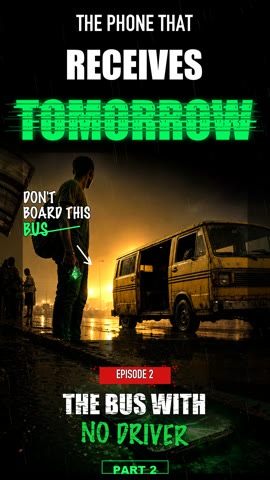
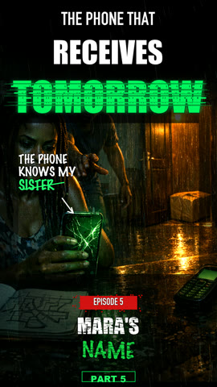

# Storyforge

Turn written short-fiction episodes into vertical videos for **TikTok**, **Instagram Reels**, and **YouTube Shorts**.

This repo is a local production pipeline that converts an episode content package into:

- ElevenLabs narrator voiceover
- OpenAI scene images
- OpenAI cover background + local typography compositing
- Local motion clips from still images (no video API credits required)
- Final synced 1080×1920 vertical MP4 with cover intro
- Preview grid, image contact sheet, and optional email notifications

## Example output

**Full interactive player (sidebar + keyboard + auto-advance):** [GitHub Pages](https://Buchiexplores.github.io/storyforge/preview/example/)

The sample series below is included in the repo. **Click a poster** to watch an episode, or use the buttons to browse.

<!-- README-PLAYER-START -->

**The Phone That Receives Tomorrow** — Example output from the Storyforge pipeline — Afro-futurist mystery thriller.

**Click any poster below to watch** that episode (opens GitHub's built-in video player). For sidebar navigation, keyboard shortcuts, and auto-advance, use the [interactive player on GitHub Pages](https://Buchiexplores.github.io/storyforge/preview/example/) (enable Pages under repo Settings → Pages → branch `main`, folder `/`).

> GitHub README cannot embed in-page video players for repo-hosted MP4s. Posters link to each episode's MP4 on GitHub where you can press play.

<p align="center">Jump to episode: <a href="#ep1">1</a> · <a href="#ep2">2</a> · <a href="#ep3">3</a> · <a href="#ep4">4</a> · <a href="#ep5">5</a> · <a href="#ep6">6</a></p>

<p align="center" id="ep1">
  <strong>Episode 1 · Do Not Open The Door</strong><br><br>
  <a href="https://github.com/Buchiexplores/storyforge/blob/main/preview/example/episode_01.mp4">
    
  </a>
  <br><br>
  <a href="https://github.com/Buchiexplores/storyforge/blob/main/preview/example/episode_01.mp4"></a> &nbsp; <a href="#ep2"></a>
</p>

<p align="center" id="ep2">
  <strong>Episode 2 · The Bus With No Driver</strong><br><br>
  <a href="https://github.com/Buchiexplores/storyforge/blob/main/preview/example/episode_02.mp4">
    
  </a>
  <br><br>
  <a href="#ep1"></a> &nbsp; <a href="https://github.com/Buchiexplores/storyforge/blob/main/preview/example/episode_02.mp4"></a> &nbsp; <a href="#ep3"></a>
</p>

<p align="center" id="ep3">
  <strong>Episode 3 · Save Her Twice</strong><br><br>
  <a href="https://github.com/Buchiexplores/storyforge/blob/main/preview/example/episode_03.mp4">
    
  </a>
  <br><br>
  <a href="#ep2"></a> &nbsp; <a href="https://github.com/Buchiexplores/storyforge/blob/main/preview/example/episode_03.mp4"></a> &nbsp; <a href="#ep4"></a>
</p>

<p align="center" id="ep4">
  <strong>Episode 4 · The Price Of A Minute</strong><br><br>
  <a href="https://github.com/Buchiexplores/storyforge/blob/main/preview/example/episode_04.mp4">
    
  </a>
  <br><br>
  <a href="#ep3"></a> &nbsp; <a href="https://github.com/Buchiexplores/storyforge/blob/main/preview/example/episode_04.mp4"></a> &nbsp; <a href="#ep5"></a>
</p>

<p align="center" id="ep5">
  <strong>Episode 5 · Mara's Name</strong><br><br>
  <a href="https://github.com/Buchiexplores/storyforge/blob/main/preview/example/episode_05.mp4">
    
  </a>
  <br><br>
  <a href="#ep4"></a> &nbsp; <a href="https://github.com/Buchiexplores/storyforge/blob/main/preview/example/episode_05.mp4"></a> &nbsp; <a href="#ep6"></a>
</p>

<p align="center" id="ep6">
  <strong>Episode 6 · The Street That Disappears</strong><br><br>
  <a href="https://github.com/Buchiexplores/storyforge/blob/main/preview/example/episode_06.mp4">
    
  </a>
  <br><br>
  <a href="#ep5"></a> &nbsp; <a href="https://github.com/Buchiexplores/storyforge/blob/main/preview/example/episode_06.mp4"></a>
</p>

<!-- README-PLAYER-END -->

Your own pipeline output is written to each episode's `assets/exports/` folder (gitignored, not pushed).

## Quick start

```bash
git clone <your-repo-url>
cd storyforge

./setup.sh  # creates .venv, installs deps, copies .env.story.example
# Edit .env.story.local with your API keys

# Option A: use the included example series
python3 tools/run_episode_pipeline.py --episode episode_01

# Option B: scaffold your own series
python3 tools/init_series.py --name "My Story Series" --style thriller_mystery
# Set PIPELINE_SERIES_DIR=series/my_story_series in .env.story.local
# Edit series/my_story_series/episode_01/scenes.json and voiceover_text.txt
python3 tools/run_episode_pipeline.py --series series/my_story_series --episode episode_01
```

## What you need

| Requirement | Purpose |
|-------------|---------|
| Python 3.10+ | Run pipeline scripts |
| ffmpeg + ffprobe | Video rendering |
| OpenAI API key | Scene images and cover backgrounds |
| ElevenLabs API key + voice ID | Narrator voiceover |

Optional: fal.ai key if you want AI-generated motion clips instead of local Ken Burns-style motion.

## Repository layout

```text
storyforge/
  .env.story.example          # Config template (copy to .env.story.local)
  config/style_templates/     # Reusable visual + platform style presets
  docs/                       # Full onboarding and reference docs
  examples/phone_from_tomorrow/  # Example series scripts (Episodes 1-9)
  preview/example/            # Sample rendered episodes (watch before you run the pipeline)
  series/                     # Your own series go here (empty by default)
  templates/                  # Scaffolding templates for new series/episodes
  tools/                      # Pipeline scripts
```

## Documentation

Start here for full onboarding:

- **[docs/GETTING_STARTED.md](docs/GETTING_STARTED.md)** — install, configure, first render, batch workflow
- **[docs/STORY_AUTHORING.md](docs/STORY_AUTHORING.md)** — write scripts, scenes.json, style templates
- **[docs/CONFIGURATION.md](docs/CONFIGURATION.md)** — all environment variables and series config
- **[docs/PLATFORM_GUIDE.md](docs/PLATFORM_GUIDE.md)** — TikTok, Instagram Reels, YouTube Shorts publishing
- **[docs/TROUBLESHOOTING.md](docs/TROUBLESHOOTING.md)** — common failures and fixes
- **[docs/AI_BATCH_PROMPT.md](docs/AI_BATCH_PROMPT.md)** — prompt for AI-assisted episode writing batches

## Run one episode

```bash
python3 tools/run_episode_pipeline.py \
  --series examples/phone_from_tomorrow \
  --episode episode_01 \
  --force
```

Output:

```text
examples/phone_from_tomorrow/episode_01/assets/exports/episode_01_vertical.mp4
```

## Create a new series

```bash
python3 tools/init_series.py \
  --name "The Last Signal" \
  --style sci_fi \
  --output-dir series
```

Built-in style templates: `thriller_mystery`, `romance_drama`, `sci_fi`

## License

MIT — see [LICENSE](LICENSE).
